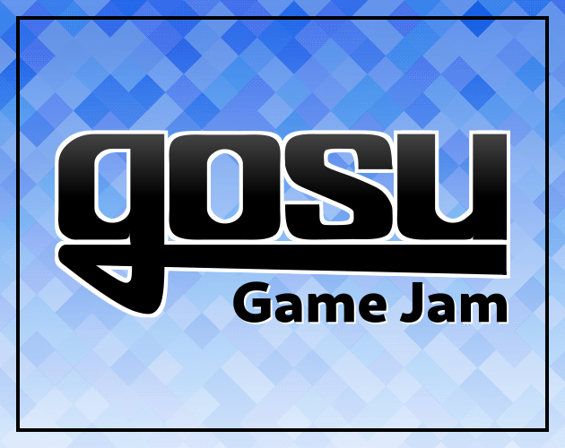

# ABOUT
Join in on the first **Gosu Game Jam!** It has been talked about for over 3 years and now its HAPPENING!

[Words!]

Don't worry if you miss this one, the community will host a jam once every 3 to 4 months going forward.

# RULES
* Work alone or in a team
* Create a game in a week
* Use any library or gem as long as it uses Gosu underneath
* You are free to use 3rd party artwork, music, and audio assets that you have permission to use
* Use [Ruby](https://rubygems.org/gems/gosu), [MRuby*](https://github.com/cyberarm/mruby-gosu), [Crystal*](https://github.com/gosu/gosu.cr), or [C++](https://github.com/gosu/gosu) to create your game
* Game must be playable, either pre-compiled or share source code and assets

__* Experimental, may be unstable__

# COMMUNITY
Join the official [Discord](https://discord.gg/gTaHxdm) community server

Gosu's website: [libgosu.org](https://libgosu.org)

# RESOURCES
* Music, Sound Effects, and Artwork — [OpenGameArt.org](https://opengameart.org)
* Music and Sound Effects — [FreeSound.org](https://freesound.org)
* Sound Effects — [BigSoundBank.com](https://bigsoundbank.com)
* Music — [BenSound.com](https://bensound.com)